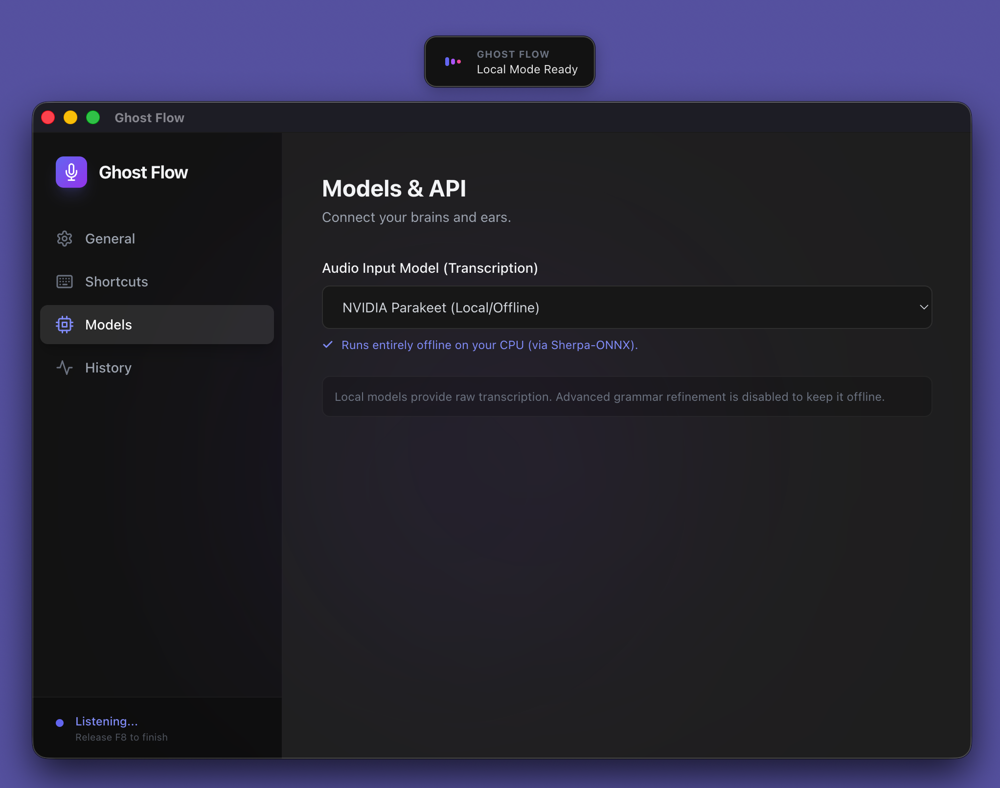

# Ghost Flow

Ghost Flow is a macOS audio dictation app that transforms your voice into clean, polished text. Speak naturally and watch your words appear on screen—automatically pasted wherever you're typing.



**Key Features:**
- **Three transcription modes** to match your needs: Cloud streaming, Cloud batch with AI refinement, or completely offline
- **Smart hotkey system**: Tap to toggle recording on/off, or hold for push-to-talk
- **Automatic pasting**: Text appears exactly where your cursor is
- **Privacy-first**: Local mode runs entirely on your Mac without internet

---

## The Three Transcription Modes

Ghost Flow offers three different ways to transcribe your voice, each optimized for different use cases:

### 🌐 Mode 1: GPT-4o Realtime (Cloud Streaming)

**Best for:** Quick messages, real-time feedback, fast-paced dictation

- **Live transcription** as you speak—see words appear on screen instantly
- **Automatic speech detection** (VAD) knows when you stop talking
- **Direct output**—no post-processing, just pure transcription
- **Requires:** OpenAI API key and internet connection

**Use cases:**
- Quick emails or Slack messages
- Live note-taking during meetings
- When you want to see what you're saying in real-time
- Short to medium-length messages (under 2 minutes)

---

### 🎙️ Mode 2: Whisper (Cloud + AI Refinement)

**Best for:** Formal writing, long-form dictation, polished documents

- **Record → Stop → Transcribe** workflow for complete sessions
- **AI-powered refinement** that removes filler words ("um", "uh"), fixes punctuation, and corrects grammar
- **High accuracy** with OpenAI's Whisper model
- **Customizable** system prompt for your specific writing style
- **Requires:** OpenAI API key and internet connection

**Use cases:**
- Writing reports, articles, or blog posts
- Professional documentation
- When you need grammatically perfect, well-punctuated text
- Longer sessions (2+ minutes of continuous speech)

---

### 🔒 Mode 3: NVIDIA Parakeet (Local/Offline)

**Best for:** Sensitive work, offline environments, zero-cost operation

- **Completely private**—runs entirely on your Mac's CPU
- **No internet required** after initial model download
- **No API costs**—pay nothing after downloading the model
- **First-time setup**: Downloads ~200MB model file once
- **Raw transcription** without AI refinement (fastest processing)

**Use cases:**
- Dictating confidential information
- Working without internet (airplane mode, secure networks)
- Avoiding subscription costs
- When privacy matters more than perfect grammar

---

## Core Features

### Smart Hotkey System

Ghost Flow uses a **hybrid trigger** system that adapts to how you press the hotkey (default: F8):

- **Tap F8** (< 0.4 seconds): Toggle recording on/off. Recording stays active until you tap again.
- **Hold F8** (> 0.4 seconds): Push-to-talk. Recording stops immediately when you release.

**Tip:** Use tap for long dictation sessions (like writing an email). Use hold for quick bursts (like adding a note).

### Overlay Interface

A sleek, semi-transparent overlay shows your recording status:

- **Listening**: Animated waveform while capturing audio
- **Processing**: Loading indicator during transcription
- **Done**: Displays your transcribed text briefly before pasting

**7 positioning options**: Top-left, Top-right, Top-center, Bottom-left, Bottom-right, Bottom-center, Center

Configure overlay position in Settings → General.

### History Management

Ghost Flow automatically saves your last 50 transcriptions locally:

- View all past dictations in Settings → History
- Copy any previous entry to clipboard
- Clear history anytime
- Stored at `~/.ghostflow_history.json`

### Sound Feedback

Optional audio cues confirm your actions:

- **Start**: Gentle chime when recording begins
- **Stop**: Soft pop when recording ends
- **Success**: Glass sound when transcription completes
- **Error**: Bass sound if something fails

Toggle in Settings → General.

---

## Installation

### Prerequisites

- **macOS** 12.0 Monterey or newer
- **Python 3.9+**
  - Check: `python3 --version`
  - Install if missing: `brew install python`

### Quick Setup

1. Navigate to your Ghost Flow directory
2. Make the script executable:
   ```bash
   chmod +x scripts/run_ghost_flow.sh
   ```
3. Run the app:
   ```bash
   ./scripts/run_ghost_flow.sh
   ```

The script automatically:
- Creates a virtual environment
- Installs all dependencies
- Launches Ghost Flow

---

## First-Time Setup

### Grant Permissions

Ghost Flow requires macOS permissions to function:

1. **Accessibility**: Required for global hotkey and automatic pasting
   - Go to System Settings → Privacy & Security → Accessibility
   - Add Ghost Flow (or Terminal if running from command line)
   - Grant full disk access if prompted

2. **Microphone**: Required for audio capture
   - Go to System Settings → Privacy & Security → Microphone
   - Enable Ghost Flow or Terminal

**Note:** You may need to restart Ghost Flow after granting permissions.

### Configure Your Transcription Mode

Open Ghost Flow's Settings window and select your preferred mode in **Models & API**:

**For Cloud modes (Whisper or Realtime):**
1. Enter your OpenAI API key
2. Choose your transcription model
3. For Whisper mode: Select a refinement model (GPT-5 Nano, GPT-4o Mini, GPT-4o)
4. Optional: Customize the system prompt for refinement

**For Local mode:**
1. Select "NVIDIA Parakeet (Local/Offline)"
2. Ghost Flow will automatically download the model (~200MB)
3. Wait for "Model Ready" confirmation

### Customize Settings

**General Tab:**
- **Overlay Position**: Choose where status appears
- **Sound Feedback**: Toggle audio cues on/off
- **Permissions Status**: Verify Accessibility access

**Models & API Tab:**
- Switch between transcription modes anytime
- Update API keys
- Configure refinement (Whisper only)

**Shortcuts Tab:**
- Change global hotkey (default: F8)

---

## Usage

### Basic Dictation

1. Place your cursor where you want text to appear (email editor, text document, etc.)
2. Press F8 (or your custom hotkey)
3. Speak clearly and naturally
4. Press F8 again to stop
5. Text appears automatically after 1-2 seconds

### Tap vs Hold

**Tap (toggle mode):**
- Tap once to start recording
- Speak for as long as you want
- Tap again to stop and process
- Use for: Writing emails, reports, anything over 30 seconds

**Hold (push-to-talk):**
- Hold down the key to record
- Release to stop immediately
- Text appears quickly
- Use for: Quick notes, short sentences, real-time messages

### Streaming vs Batch

**Streaming (Realtime or Local modes):**
- See text appear as you speak
- Automatic silence detection stops recording
- Best for: Short to medium messages, immediate feedback

**Batch (Whisper mode):**
- Record entire session first
- Process after you stop
- Higher accuracy with refinement
- Best for: Long-form content, formal writing

---

## Configuration Guide

### Choosing Your Mode

| Need | Recommended Mode |
|------|------------------|
| **Privacy & security** | Parakeet Local |
| **Cost-free operation** | Parakeet Local |
| **Formal, polished text** | Whisper (Cloud) |
| **Quick, instant feedback** | GPT-4o Realtime |
| **Offline capability** | Parakeet Local |
| **Highest accuracy** | Whisper (Cloud) |
| **Real-time collaboration** | GPT-4o Realtime |

### Streaming Settings (Realtime/Local modes)

Adjust Voice Activity Detection (VAD) sensitivity in Settings → Streaming:

- **Silence Duration**: How long to wait after speech before stopping (default: 600ms)
  - Lower: Faster, may cut off words
  - Higher: More forgiving, longer pause before stop

- **VAD Aggressiveness**: How sensitive speech detection is (scale: 0-3, default: 2)
  - Lower: Detects quieter speech but more false positives
  - Higher: Ignores background noise but may miss soft speech

### Refinement Settings (Whisper mode)

**System Prompt** controls how AI polishes your transcription:

Default prompt (removes filler words, fixes grammar):
```
You are a precise dictation assistant. Your task is to correct the grammar,
punctuation, and capitalization of the user's raw transcript. Remove filler
words (um, uh, like). Do not change the meaning. Do not add introductory
text. Output only the refined text.
```

Customize for specific needs:
- Keep "um" and "uh" for verbatim transcripts
- Add specific formatting instructions
- Adjust tone (formal, casual, technical)

**Refinement Models:**
- **GPT-5 Nano (2025)**: Fastest, good for most cases
- **GPT-4o Mini**: Balanced speed and quality
- **GPT-4o**: Highest quality, slower processing

---

## Troubleshooting

### "No API Key" Error

**Problem:** Transcription fails with "No OpenAI API Key set."

**Solution:**
1. Open Settings → Models & API
2. Enter your OpenAI API key (starts with `sk-proj-`)
3. Ensure you're using a cloud mode (Whisper or Realtime)

**Get an API key:** https://platform.openai.com/api-keys

### No Audio Captured

**Problem:** Recording stops immediately or shows "No Audio"

**Solutions:**
1. **Check microphone permission**
   - System Settings → Privacy & Security → Microphone
   - Enable Ghost Flow or Terminal

2. **Test microphone**
   - Open Voice Memos app and record something
   - If Voice Memos works, the issue is Ghost Flow permissions

3. **Restart Ghost Flow** after granting permissions

### Accessibility Issues

**Problem:** Hotkey doesn't work or text doesn't paste

**Solutions:**
1. **Grant Accessibility permission**
   - System Settings → Privacy & Security → Accessibility
   - Add Ghost Flow or Terminal

2. **Full Disk Access** (if prompted)
   - System Settings → Privacy & Security → Full Disk Access
   - Enable Ghost Flow or Terminal

3. **Restart Ghost Flow** after granting permissions

### Model Download Fails (Local Mode)

**Problem:** "Download Failed" or model doesn't load

**Solutions:**
1. **Check internet connection** (download requires ~200MB)
2. **Delete partial files** and try again:
   ```bash
   rm -rf ~/.ghostflow_models
   ```
3. **Restart Ghost Flow**—it will re-download
4. **Check disk space**—ensure you have at least 500MB free

### Overlay Doesn't Appear

**Problem:** Overlay window is missing or misplaced

**Solutions:**
1. **Check overlay position** in Settings → General
2. **Reset position** to default (top-right)
3. **Restart Ghost Flow** if overlay is stuck

### Transcription Quality Issues

**Problem:** Inaccurate or poor transcription

**Solutions:**

**Cloud modes (Whisper/Realtime):**
- Speak clearly and at a moderate pace
- Reduce background noise
- Try a different OpenAI model
- For Whisper mode, adjust system prompt

**Local mode:**
- Parakeet is optimized for English
- Lower VAD aggressiveness for quiet speech
- Ensure model downloaded completely (check console for errors)
- Consider cloud mode for critical accuracy requirements

### Streaming Mode Issues

**Problem:** Text cuts off early or recording doesn't stop

**Solutions:**
1. **Adjust Silence Duration** in Settings → Streaming
   - Increase if text cuts off too early
   - Decrease if recording takes too long to stop

2. **Adjust VAD Aggressiveness**
   - Decrease if recording doesn't start when you speak
   - Increase if background noise triggers false starts

3. **Switch to batch mode** (Whisper) for difficult environments

### App Won't Launch

**Problem:** Ghost Flow crashes immediately

**Solutions:**
1. **Check Python version**: `python3 --version` (must be 3.9+)
2. **Reinstall dependencies**:
   ```bash
   rm -rf venv
   ./scripts/run_ghost_flow.sh
   ```
3. **Check macOS version**: Must be 12.0+ (Monterey)
4. **Check console output** for specific error messages

---

## Technical Details

### File Locations

- **Config**: `~/.ghostflow_config.json`
- **History**: `~/.ghostflow_history.json`
- **Local Models**: `~/.ghostflow_models/`

### Dependencies

View `requirements.txt` for full list of Python packages.

### Logs

Check console output when running from Terminal for debugging information.

---

## Tips for Best Results

### Voice Quality

- **Speak clearly and naturally**—don't over-enunciate
- **Maintain consistent distance** from microphone (6-12 inches)
- **Reduce background noise**—quiet environment improves accuracy
- **Pause between sentences**—helps VAD detect natural breaks

### Workflow Tips

- **Batch long sessions**: Use Whisper mode for recordings over 2 minutes
- **Quick messages**: Use Realtime or Local mode for speed
- **Review History**: Check Settings → History to recover previous dictations
- **Customize prompts**: Tune the system prompt for your specific use case

### Mode Selection

- **Writing code**: Whisper mode with technical prompt
- **Emails**: Realtime mode for speed
- **Sensitive data**: Local mode only
- **Meeting notes**: Realtime or Local with high VAD sensitivity

---

## Support

For issues, feature requests, or contributions:

- Check this README's troubleshooting section
- Review `AGENTS.md` for technical documentation
- Open an issue on GitHub

---

**Ghost Flow** v1.1  
macOS audio dictation powered by OpenAI & NVIDIA Parakeet
